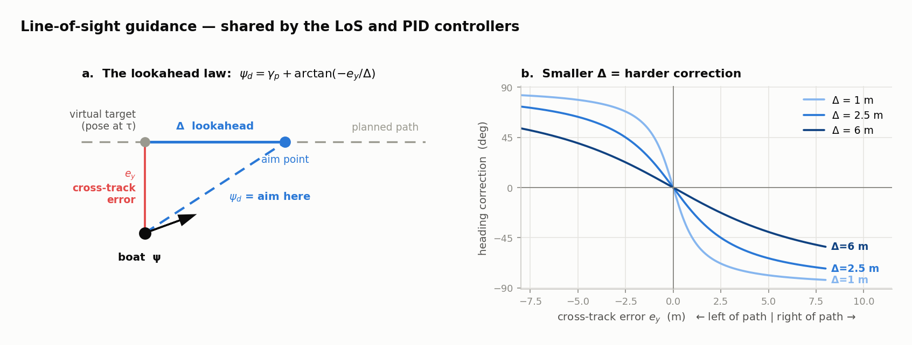
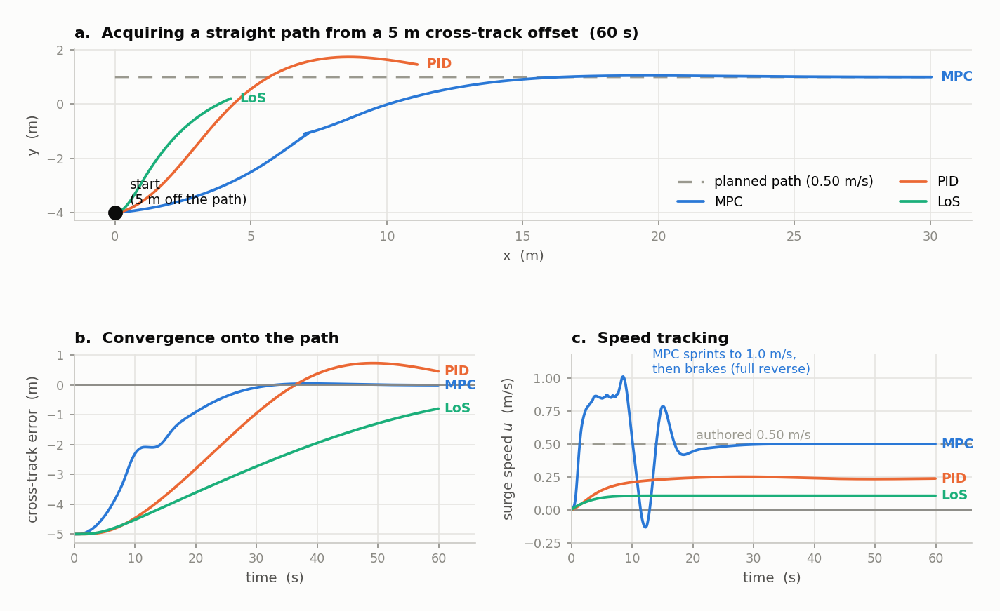
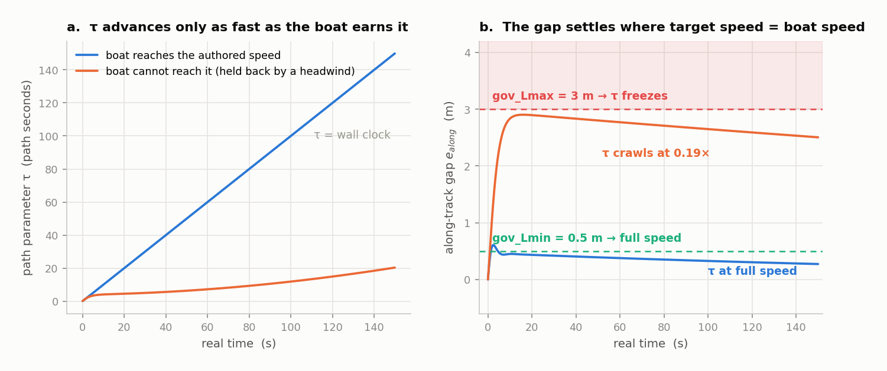
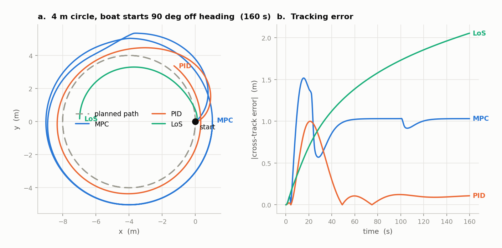
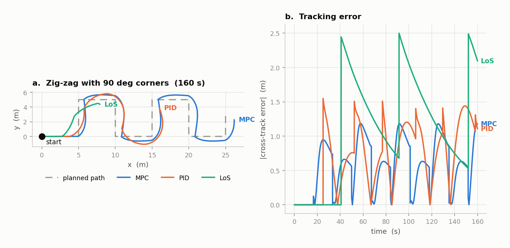
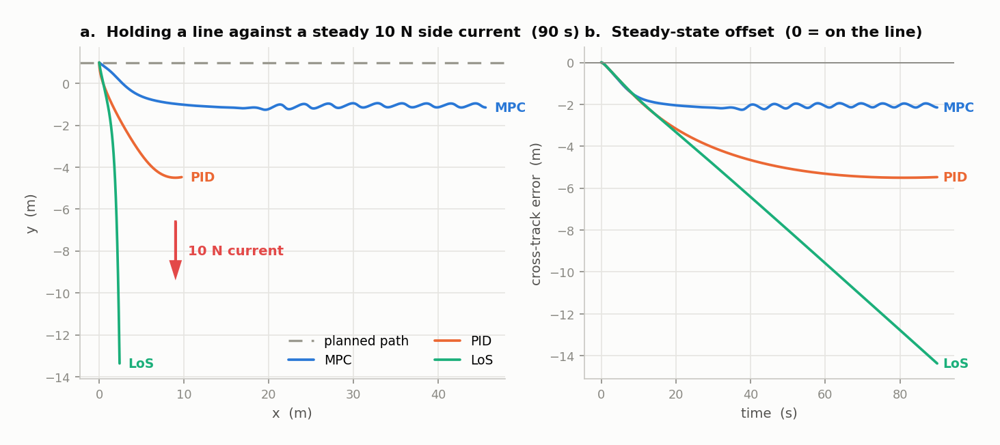
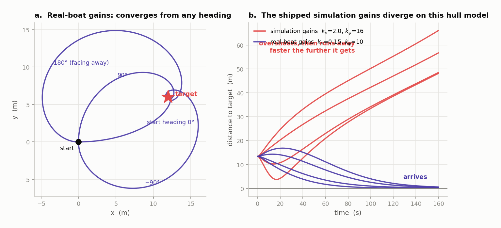
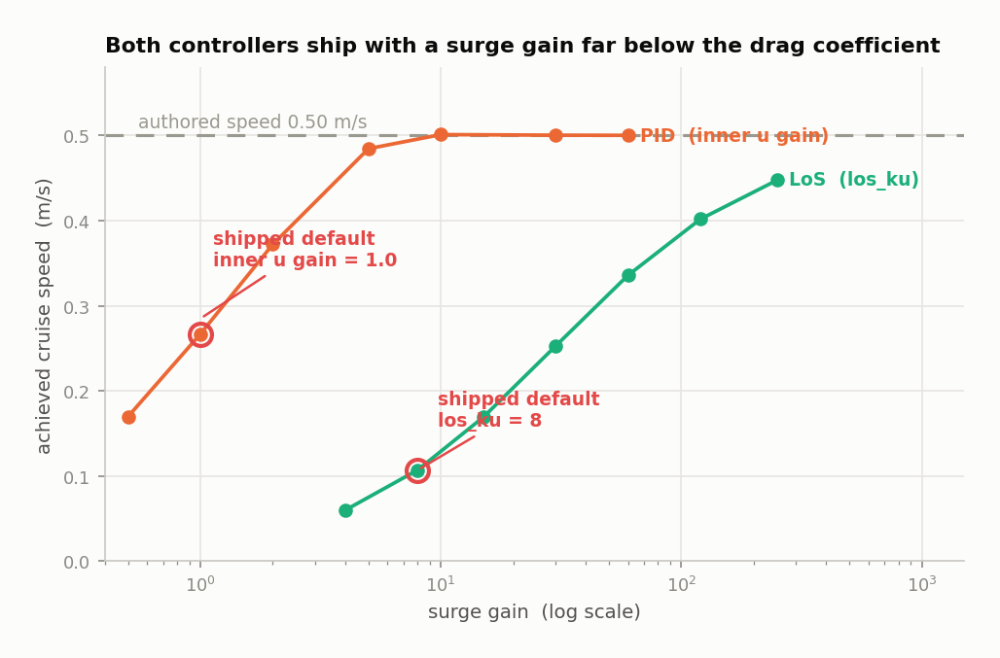
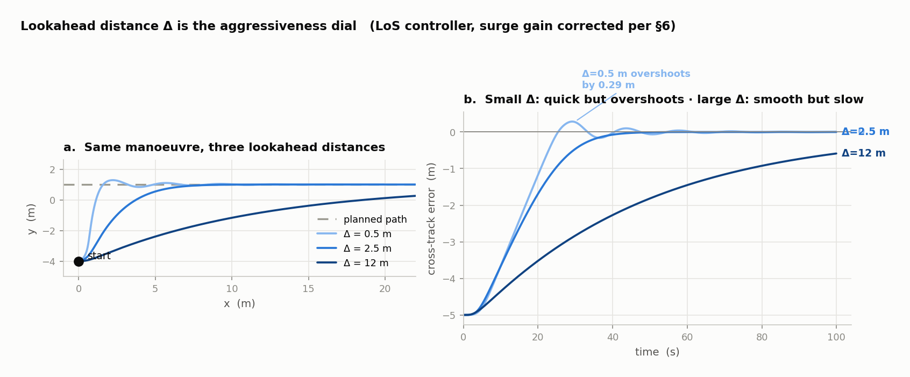

# BlueBoat Controllers — Comparison & Field Guide

Companion to [TRAJECTORY_SYSTEM.md](TRAJECTORY_SYSTEM.md). That document explains **where the
target comes from**; this one explains **what each controller does with it**.

Four controllers ship in this package. This guide covers, for each one: what it is, every
parameter, how it behaves when the boat is displaced from the target, how it compares with
what the USV literature actually uses, where it is strong, where it is weak, and how to tune it.

---

## How the numbers in this document were produced

Every plot is a **closed-loop simulation**, not a sketch.

| Piece | Source |
|---|---|
| Boat model | The exact 3-DOF Fossen model from [MPC/ur_mpc.py](MPC/ur_mpc.py) — same mass, added mass, Coriolis, damping and thrust-allocation matrix — integrated with RK4 at 100 Hz |
| `PID` controller | The **real** `PIDLoS` class, imported from [PID/PID.py](PID/PID.py) |
| `LoS` controller | Line-for-line reimplementation of `master_control.los_guidance` |
| `Point-LoS` | Line-for-line reimplementation of `master_control.solve_LoS` |
| `MPC` | The same optimal-control problem as [MPC/ur_mpc.py](MPC/ur_mpc.py) (same model, same `Q`/`R`, same `N`/`T`, same reference construction including the 15-vs-16 pose padding), re-solved with SciPy SLSQP instead of acados |
| Reference & governor | Verbatim from `path_generation.single_pose`, `path_progress_errors`, `advance_governor`, `compute_target` |

> **Two caveats, stated up front.**
> 1. The plant used here **is the model the MPC itself assumes**. That flatters MPC: it is
>    being graded with a perfect model of the boat. On the water, model error will close
>    part of the gap you see below.
> 2. acados solves the MPC with SQP-RTI; SciPy SLSQP is a different solver on the same
>    problem. Trends and magnitudes are right; exact traces will differ slightly.
>
> Everything about the **other three** controllers is exact — that code is pure numpy and
> runs here unmodified.

---

## 1. What the boat can physically do

No controller can beat these limits, so it is worth knowing them before blaming a controller.
⚠ **There are two different boats here, and this section used to conflate them.**
The left column below is the model `master_control` hands the MPC for the **real boat**;
the right is what the **Gazebo simulator** actually integrates
(`blueboat_description/urdf/hydrodynamics.xacro`). They are not the same system, and the
figures this table used to publish were the left column's — which is why "max surge speed
1.36 m/s" appeared here while the simulated boat could not exceed 0.78 m/s.

The decisive difference is that the plant has **quadratic** damping and the MPC's model
formulation has none: `export_underwater_model` carries a linear `D` only. Below ~0.4 m/s
the two roughly agree; above it they diverge fast.

| Quantity | Real-boat model (`master_control`) | Gazebo plant (`hydrodynamics.xacro`) |
|---|---|---|
| Surge drag | 29.34·u | 25.15·u + 33.80·u\|u\| |
| Sway drag | 51.54·v | 7.364·v + 54.269·v\|v\| |
| Yaw drag | 44.65·r | 3.744·r + 40.00·r\|r\| |
| Effective surge mass | 42.78 kg (16.01 + 26.77) | **21.51 kg** (16.01 + 5.5) |
| Effective yaw inertia | 27.41 kg·m² (5.64 + 21.77) | **5.76 kg·m²** (5.64 + 0.12) |
| Thruster limit | ±20 N each, ±40 N total | same |
| Thruster half-spacing | 0.295 m | same |
| **Max surge speed** | 1.36 m/s (40 ÷ 29.34) | **0.78 m/s** |
| **Max yaw moment** | 11.8 N·m (0.295 × 40) | same |
| **Max yaw rate** | 0.264 rad/s (15 °/s) | **~0.50 rad/s (29 °/s)** |

The provenance of the left column is unknown (§6.4); the right column is read straight out of
the xacro, which is the BlueROV2 table applied to a BlueBoat hull (`README.md`). **Neither is
an identification of the real BlueBoat**, and none exists anywhere in the project.

### Thrust required to cruise, in simulation

The single most useful table for choosing a mission speed. Straight and level, no turning, no
error correction — this is the floor, not the budget:

| speed | N total | **per thruster** | fraction of the ±20 N limit |
|---|---|---|---|
| 0.30 m/s | 10.6 | 5.3 | 26 % |
| 0.45 m/s | 18.2 | 9.1 | 45 % |
| 0.62 m/s | 28.6 | 14.3 | 71 % |
| 0.70 m/s | 34.2 | 17.1 | 85 % |
| 0.78 m/s | 40.2 | 20.1 | **100 % — the ceiling** |
| 1.00 m/s | 58.9 | 29.5 | unreachable |

⚠ **Author simulated missions at ≤ 0.45 m/s where there is margin to manoeuvre**, and treat
0.70 m/s as the practical maximum: at 0.70 the straight legs alone consume 85 % of the limit,
so every turn saturates, and measured MPC saturation is 24 % of ticks even with everything
tuned. Above 0.78 m/s no controller can follow at all — PID logs 100 % saturation and a
growing error at an authored 0.84 m/s. This ceiling is a property of the *simulator's*
drag table, not of the real boat.

Two consequences that shape everything below:

* **The boat turns slowly.** 24 s per revolution at full differential thrust. Any guidance law
  that demands fast heading changes will simply not get them, and a lookahead distance
  smaller than the turning radius is asking for trouble.
* **A 90° corner is impossible.** `kin_square` and any designer pattern with square corners
  demands infinite curvature; the boat needs at least 1.9 m of radius. Expect ≈2 m of
  overshoot at every corner no matter which controller you pick.

---

## 2. The four controllers at a glance

| | **MPC** | **PID** | **LoS** | **Point-LoS** |
|---|---|---|---|---|
| Selected by | `controller_type:=MPC` | `:=PID` | `:=LoS` | automatic (pinger / manual) |
| Full name | Nonlinear model predictive control | Cascaded PID + lookahead LoS | Kinematic lookahead LoS | Body-frame pure pursuit |
| Code | [MPC/ur_mpc.py](MPC/ur_mpc.py) | [PID/PID.py](PID/PID.py) | [master_control.py:293](master_control.py#L293) | [master_control.py:322](master_control.py#L322) |
| Follows a **path**? | yes | yes | yes | **no — chases a point** |
| Needs a boat model? | **yes** (mass, drag, added mass) | no | no | no |
| Needs a solver? | **yes** (acados + CasADi) | no | no | no |
| Respects thruster limits? | **inside the optimisation** | by clipping afterwards | by clipping afterwards | no |
| Look-ahead in time? | **2.5 s horizon** | none | none | none |
| Loops | one optimisation | 4 PIDs (2 outer, 2 inner) | 2 proportional gains | 2 proportional gains |
| Tuning knobs | 8 weights + horizon | 12 gains + Δ | 4 gains + Δ | 2 gains |
| CPU cost | high | negligible | negligible | negligible |
| Common in USV literature? | **yes — the modern standard** | **yes — the classical standard** | as a *baseline* | yes, for waypoint homing |

---

## 3. The idea three of them share: line-of-sight guidance

`MPC` is the odd one out. `PID`, `LoS` and (loosely) `Point-LoS` all steer with the same
trick, so it is worth understanding once.



Do not aim at the target. **Aim at a point Δ metres further along the path.**

```
psi_d = gamma_p + atan2(-e_y, Delta)
         ▲            ▲         ▲
         │            │         └── lookahead distance (2.5 m here)
         │            └── how far off the path you are, sideways
         └── the direction the path is heading right now
```

Why this works: when you are far off the path, `atan2` saturates near ±90° and the boat
turns almost perpendicular to the path and drives straight at it. As the gap closes, the
correction fades smoothly to zero and the boat blends onto the path tangent instead of
crossing it and oscillating. Panel **b** above is the whole tuning story — **Δ is the
aggressiveness dial**.

This is Fossen's *lookahead-based steering*, the standard marine guidance law (Fossen,
Breivik & Skjetne 2003; *Handbook of Marine Craft Hydrodynamics and Motion Control*, 2011).
The usual heuristic is Δ ≈ 2–4 vessel lengths; BlueBoat's hull is about 1.2 m, so the
shipped Δ = 2.5 m sits right at the low end of the normal range. **The implementation in
this repo is correct** — I checked the signs in all three places it appears and they agree
with each other and with the textbook.

---

## 4. Controller-by-controller

### 4.1 `MPC` — nonlinear model predictive control

**What it does.** Every 50 ms it asks: *given where I am now and my model of how this boat
responds, what sequence of 15 thruster commands over the next 2.5 s brings me closest to the
next 15 reference poses, while never exceeding ±20 N?* It solves that optimisation, applies
the first command, and throws the rest away.

It is the only controller here that **knows what the boat is made of** — and that is the
entire source of its advantage. Because drag is in the model, it works out the exact thrust
needed to hold 0.5 m/s without anyone tuning a gain.

**Parameters** — declared in `master_control._declare_tuning_parameters`. Since 2026-08-31
the MPC is **split simulation vs real boat**, the same way the PID gains and the
point-following gains are, and the split covers the plant *model* as well as the weights:

| Parameter | Real boat | **Simulation** | Meaning |
|---|---|---|---|
| `mpc_horizon` | 15 | **30** | Number of prediction steps |
| `mpc_time` | 2.5 s | **6.0 s** | How far ahead it plans |
| `mpc_Q_diag` | diag(50, 50, 30, 1, 1, 1) | same | Cost on x, y, ψ, u, v, r error |
| `mpc_R_diag` | diag(0.015, 0.015) | **diag(0.10, 0.10)** | Cost on thruster effort |
| `thrust_limit` | ±20 N | same | Hard constraint inside the solver |
| model `a_u, a_v, a_r` | −26.77, −7.55, −21.77 | **−5.50, −12.70, −0.12** | added mass |
| model `d_u, d_v, d_r` | −29.34, −51.54, −44.65 | **−40.36, −12.79, −9.74** | linear drag |

The real column is unchanged and remains the configuration all earlier field and harness
results were taken at. The simulation column is fitted to the Gazebo plant (§3): the added
mass entries are the xacro's `xDotU`/`yDotV`/`nDotR` verbatim, and each `d_*` is a **secant
linearisation** of that axis's linear+quadratic drag at a representative operating point
(0.45 m/s surge, 0.10 m/s sway, 0.15 rad/s yaw — the last being the p75 of |r| measured
across every recorded sim run). Refit them if `hydrodynamics.xacro` changes.

`mpc_time`/`mpc_horizon` stay at 2.5 s/15 on the real boat because the acados solve has
never been timed on the companion computer (`TODO.md` §2); doubling the horizon is exactly
the change that would break the 50 ms budget. At N = 30 in simulation the loop holds a
measured 20.0 Hz with no watchdog trips.

**Why `R` had to move.** The stage cost is `(x−x_ref)ᵀQ(x−x_ref) + uᵀRu` with `u_ref ≡ 0`
and no rate term, so `R` is an absolute effort penalty in N². The break-even — the position
error whose cost equals saturating *both* thrusters — is `sqrt(2·R·400/50)`:

| `R` | 0.015 | 0.05 | **0.10** | 0.15 | 0.25 |
|---|---|---|---|---|---|
| break-even | 0.49 m | 0.89 m | **1.26 m** | 1.55 m | 2.00 m |

At the shipped 0.015, anything beyond half a metre of error makes full throttle literally the
cheaper option. That is why the MPC saturated where PID — whose demand its own P-gain bounds
— did not.

**Measured effect of the whole change** (4-lane lawnmower survey, 4 m corner radius,
`docs/controllers/mpc_tuning_report.py`):

| | before | after |
|---|---|---|
| 0.70 m/s — saturated ticks | 77.5 % | **24.3 %** |
| 0.70 m/s — mean radial error | 1.61 m | **0.30 m** |
| 0.70 m/s — differential sign flips /100 | 13.8 | **2.2** |
| 0.45 m/s — saturated ticks | 64.8 % | **1.4 %** |
| 0.45 m/s — mean radial error | 11.57 m | **0.06 m** |
| `kin_square` 0.30 m/s — saturated | 2.8 % | **0.0 %** |

The residual 24 % at 0.70 m/s is physics, not tuning: the straight legs alone need 85 % of the
thrust limit (§3), so every turn saturates.

**Behaviour.** Best tracker by a wide margin — RMS cross-track error **0.015 m** in the
acquisition test, versus 0.66 m (PID) and 1.18 m (LoS). It reaches the authored 0.50 m/s
exactly. But look at panel **c** of the next figure: it gets there by **sprinting to 1.0 m/s
— double the authored speed — then braking with full reverse thrust**. That is the optimiser
correctly exploiting the whole envelope to minimise a quadratic cost. On a real boat it means
loud, aggressive thruster reversals.

**Strengths**
* Most accurate tracking on straight paths and at corners, and the only controller that
  reaches the authored speed with no gain tuning at all.
* Handles thruster saturation *properly* — it plans around the limit instead of hitting it.
* Anticipates: it starts turning before a corner because the corner is inside its horizon.
  This is why it wins the zig-zag test (§5.3) outright.
* No hand-tuning of gains; you tune intent (weights) instead.

> **But not on curves, as shipped.** On the 4 m circle the PID beats it ten to one, purely
> because the horizon is too short (§5.2, finding C9). Fix that one number and MPC leads
> everywhere.

**Weaknesses**
* **Only as good as its model.** Every number above is a guess about a real hull. Get the
  drag wrong and the advantage evaporates.
* **The shipped 2.5 s horizon is too short** — it covers less than half a turning radius, which
  costs a full metre of tracking error on any curved path (§5.2). This is the single
  highest-value MPC change available.
* Heavy: needs acados + CasADi compiled on the vehicle. This is the biggest deployment obstacle.
* Aggressive control effort unless `R_weight` is raised.
* If the solver fails, `ur_mpc.solve` only *prints* a message — there is no fallback.
* **Heading wrap-around is not handled** (finding C2).

**Literature.** Very common — NMPC is the mainstream modern approach for USV trajectory
tracking in research, and acados is the standard toolchain for embedded implementations
(Verschueren et al., *acados*, Math. Prog. Comp. 2022). Less common in fielded commercial
vessels, where solver reliability and compute cost still favour the classical stack.

**Tuning recipe**
1. **Lengthen the horizon first**: `mpc_time` 2.5 s → **5–6 s** (and `mpc_horizon` 15 → ~30 to
   keep the step size near 0.17 s). Measured effect on the circle: 1.02 m error → 0.011 m.
2. Get the model right. Nothing else matters as much. Measure drag by running at constant
   thrust and recording the terminal speed: `d_u = thrust / speed`.
3. Wandering off the path → raise `Q[0,0]`, `Q[1,1]`.
4. Thrusters slamming / oscillating → raise `R_weight` (try 0.05–0.1). This is the knob for
   the sprint-and-brake behaviour of §5.1.
5. Solver too slow → reduce `mpc_horizon` (coarser steps) before shortening `mpc_time`. Keep
   the *duration*; spend the savings on resolution.

---

### 4.2 `PID` — cascaded PID with LoS guidance

**What it does.** Two nested layers:

```
   position error ──► OUTER ──► speed & yaw-rate references ──► INNER ──► forces ──► thrusters
                   (pid_x, pid_psi)                        (pid_u, pid_r)
```

The outer loop turns "you are 2 m off the path" into "you should be going 0.6 m/s and turning
at 0.3 rad/s". The inner loop turns that into Newtons. Steering comes from the LoS law of §3;
the path's authored speed is injected as a **feedforward** (`u_ff`), so the PID only has to
correct the residual.

**Parameters** — [master_control.py:182-202](master_control.py#L182-L202):

| Parameter | Default | Meaning |
|---|---|---|
| `outer_gains['x']` | (3.0, 0.01, 0.0) | Along-track error → surge speed reference |
| `outer_gains['psi']` | (3.0, 0.01, 0.0) | Heading error → yaw-rate reference |
| `inner_gains['u']` | **(1.0, 0.0, 0.0)** | Speed error → surge force **← see §6** |
| `inner_gains['r']` | **(1.5, 0.0, 0.0)** | Yaw-rate error → yaw moment **← see §6** |
| `pid_lookahead` | 2.5 m | Δ in the LoS law |
| `thruster_limits` | ±20 N | Applied by scaling after allocation |

**Strengths**
* No model needed — works on a boat nobody has characterised.
* Trivial compute; runs anywhere.
* The cascade separates concerns: you can tune heading without touching speed.
* Integrators (however small here) can cancel steady disturbances in principle.
* Universally understood — anyone can maintain it.

**Weaknesses**
* 12 gains to tune, and the shipped inner-loop values are badly off (§6).
* No anticipation: it reacts to the error it has now, so it overshoots on corners.
* No knowledge of thruster limits until after the fact.
* Integrator windup is not guarded anywhere in [PID.py](PID/PID.py).

**Literature.** This is *the* classical marine GNC architecture — LoS guidance feeding a
cascaded speed/heading autopilot is what Fossen's textbook teaches and what essentially every
commercial marine autopilot implements. The most common architecture in the field by a wide
margin.

**Tuning recipe** (in this order — inner loops first, always)
1. **Fix `inner_gains['u']` and `inner_gains['r']` first** (§6). Nothing else can be tuned
   sensibly until the inner loops actually deliver what they are asked for.
2. Then `outer_gains['psi']` kp: raise until the boat holds heading crisply; back off 30 % if
   it hunts.
3. Then `outer_gains['x']` kp: raise until the along-track gap stays under ~0.5 m.
4. Integral terms last, and small — 0.01 is currently near-inert; 0.05–0.1 is a reasonable
   range once the proportional terms are right.
5. Δ (`pid_lookahead`) last of all: raise for smoothness, lower for tighter tracking.

---

### 4.3 `LoS` — kinematic line-of-sight

**What it does.** The simplest thing that could work — two proportional gains, no loops, no
state, no memory:

```python
u_cmd = U_d * max(0, cos(psi_err))     # authored speed, cut back while turning hard
X     = los_ku   * (u_cmd - u)         # surge force
N     = los_kpsi * psi_err - los_kd*r  # yaw moment
```

The `cos(psi_err)` term is a nice touch: **the boat slows down while it is turning hard onto
the path**, which stops it spiralling around a corner it cannot make.

**Parameters** — [master_control.py:215-221](master_control.py#L215-L221):

| Parameter | Default | Meaning |
|---|---|---|
| `los_lookahead` | 2.5 m | Δ in the LoS law |
| `los_ku` | **8.0** | Surge speed error → force **← see §6** |
| `los_kpsi` | 10.0 | Heading error → yaw moment |
| `los_kd` | 1.0 | Yaw-rate damping |
| `los_speed_scale` | 1.0 | Multiplier on authored speed |

**Strengths**
* Easiest to understand and to debug — you can predict its output by hand.
* No model, no solver, no state, nothing to wind up or diverge.
* The speed-reduction-while-turning term is genuinely good behaviour.
* A safe fallback when everything else is misbehaving.

**Weaknesses**
* **Worst tracker of the three**, and it cannot be fixed by gain tuning alone (§6).
* **No integrator anywhere** → a permanent offset under any steady disturbance.
* Station keeping is a **bolted-on mode, not the guidance law**. Below `hold_speed` the surge
  command blends to holding the reference point (steer at it, surge proportional to the range
  outside `hold_radius`), because the path law itself commands zero surge at zero authored
  speed. It works — 0.50 m in calm water, 1.00 m against a 10 N current, against unbounded
  drift before — but it is a second law living inside the first, and the boat holds a *radius*,
  not a point. `PID` needs the same treatment for a different reason and gets it the same way.
  (Finding **F2** in [TRAJECTORY_SYSTEM.md](TRAJECTORY_SYSTEM.md), closed.)
* Yaw loop is over-damped as shipped: ζ ≈ 1.38, so heading response is sluggish.

**Literature.** The *guidance law* is canonical. This particular controller — proportional
force on speed error, proportional moment on heading error, nothing else — is what you would
publish as a **baseline** to compare against, not as the deployed controller. Real
implementations put at least a PD heading autopilot and a proper speed controller underneath
the same guidance law. That is exactly what the `PID` option here is.

**Tuning recipe**
1. `los_ku`: see §6 — it needs to be far larger, or better, given a feedforward term.
2. `los_kpsi`: the yaw loop is second-order with ζ = (44.65 + `los_kd`) / (2·√(`los_kpsi`·27.41)).
   The shipped 10.0 gives ζ = 1.38 (sluggish). **`los_kpsi` = 19 gives ζ = 1.0** — critically
   damped, noticeably quicker, still no overshoot. Above ~40 it starts to oscillate.
3. `los_kd`: nearly irrelevant — the hull's own 44.65 N·m·s/rad of yaw drag dwarfs it. Do not
   bother tuning it below ~10.
4. `los_lookahead`: 2.5 m is fine; raise to 4 m if the boat weaves.

---

### 4.4 `Point-LoS` — body-frame pure pursuit *(pinger & manual targets)*

**What it does.** This one is not selected by `controller_type` — it runs automatically
whenever there is a **point** to chase rather than a path: acoustic pinger coordinates
(`use_pinger:=True`) or a manual target clicked in the visualisation app.

```python
yaw_rate = k_psi * atan2(y, x)      # x, y are in the BOAT's frame
v        = 5*log(k_v*d + 1)         # speed grows with distance, logarithmically
thrust   = [v + 0.295*yaw_rate, v - 0.295*yaw_rate]
```

Two things distinguish it: it works **entirely in the body frame** (so it needs no world
position and is immune to odometry drift — which is why pinger mode stayed out of the F8
velocity-frame question, now settled with no change), and its speed is a **logarithmic**
function of distance, so it approaches gently instead of charging.

**Parameters** — [master_control.py:738-743](master_control.py#L738-L743):

| Parameter | Simulation | Real boat | Meaning |
|---|---|---|---|
| `k_v` | 2.0 | 0.15 | Distance → speed |
| `k_psi` | 16.0 | 10.0 | Bearing → yaw rate |
| `safety_distance` | −1.0 (disabled) | | Stop-and-reverse radius |

**Strengths**
* Robust and simple; needs no path, no world frame, no odometry.
* With the real-boat gains it converges from **any** starting heading, including facing
  directly away from the target.
* Logarithmic speed law gives a naturally gentle approach.

**Weaknesses**
* **It is not path following.** It always heads straight at the target, so it cuts every
  corner. Never use it for survey lines.
* **No speed reduction when pointing the wrong way.** Unlike `los_guidance`, which multiplies
  its surge command by `cos(psi_err)`, this law drives at full speed regardless of bearing
  error — and the speed *grows with distance*. On a hull that needs 24 s to turn around, that
  is a positive feedback loop (see §5.5).
* **The simulation gains diverge** on the model used here (finding **C8**).
* `safety_distance = -1.0` **disables the stop condition**, so the arrival logic at
  [master_control.py:585-590](master_control.py#L585-L590) is dead code.
* Thrust is a raw formula with no allocation or saturation logic — it is clipped downstream.

**Literature.** This is **pure pursuit** (Coulter, CMU 1992) in all but name — the classic
waypoint-homing law across mobile robotics, and the standard "go to waypoint" behaviour on
USVs. Entirely appropriate for what it is used for here; it just is not, and does not claim
to be, a path follower.

---

## 5. Head-to-head

> **Every number in this section is simulation evidence.** It comes from the harness described
> at the top of this document, not from the water.
>
> - **The MPC is graded against the very model it assumes.** The plant here *is* `ur_mpc.py`'s
>   internal model — same mass, added mass, Coriolis, damping and allocation matrix. The MPC is
>   scored with a perfect model of the boat; the other three controllers are not.
> - **SciPy SLSQP substitutes for acados.** Same problem, same `Q`/`R`, same `N`/`T`, same
>   reference construction — a different solver.
> - **Trends and magnitudes hold; exact traces will not.** On the water, model error, unmodelled
>   disturbance and actuator behaviour move the traces.
> - **The MPC's advantage will narrow.** Most of the gap below is that modelling advantage, and
>   it is the first thing real water takes away.
>
> The `PID`, `LoS` and `Point-LoS` rows carry no such qualification — that is the real code, run
> unmodified, and they re-derive bit-for-bit by running the harness
> (`cd docs/controllers && python3 run_sims.py && python3 analyze.py`). The
> project-scope rule is `project_synthesis.md` §4 and §4.1: no layer of evidence is used above
> its evidential weight.

### 5.1 Acquiring a path from a 5 m offset

The boat starts 5 m to the side of a straight line authored at 0.50 m/s.



| | RMS cross-track (last 15 s) | Settles within 0.5 m | Cruise speed reached | Mission progress |
|---|---|---|---|---|
| **MPC** | **0.015 m** | **24 s** | **0.50 m/s** (100 %) | **1.00×** |
| **PID** | 0.661 m | 59 s | 0.235 m/s (47 %) | 0.43× |
| **LoS** | 0.033 m | 36 s | 0.202 m/s (40 %) | 0.39× |

> The LoS row is at the current `los_ku = 20.0`. At the original 8.0 it read
> 1.184 m / never / 0.107 m/s (21 %) / 0.23× — the numbers the prose below was written
> against, and the ones the figures still show.
>
> The MPC row is the one number here that does not reproduce exactly: it is SciPy SLSQP,
> not acados, and it moves with the SciPy and BLAS build (0.015–0.020 m, 24–25 s, observed).
> The `PID` and `LoS` rows are pure numpy and reproduce bit-for-bit.

Read the last column carefully: **"mission progress" is how fast the path parameter τ
advances compared to real time.** At 0.23× the LoS controller takes *four times longer* than
authored to cover the survey. The governor (see [TRAJECTORY_SYSTEM.md](TRAJECTORY_SYSTEM.md))
prevents this from becoming a tracking failure — it simply slows the target down to match —
but the mission takes four times as long, and on a battery-limited vehicle that is the same
thing as not completing it.

The cause is in §6, and it is one line of configuration.

**Why a slow controller does not become a *lost* controller.** The governor described in
[TRAJECTORY_SYSTEM.md](TRAJECTORY_SYSTEM.md) is what turns "the boat is too slow" into "the
mission takes longer" instead of "the boat loses the path entirely":



Left: with a boat that can hold the authored speed, τ tracks the wall clock 1:1. With a boat
held back — here by a headwind, but an under-gained surge loop looks identical to the
governor — τ advances at 0.19× and the mission simply stretches out. Right: the along-track
gap settles wherever the target's speed equals the boat's, safely short of the 3 m freeze
threshold. **This is why the §6 bug is easy to miss on the water: nothing looks broken, the
survey just takes four times too long.**

### 5.2 A curved path — the 4 m circle



**The ranking reverses.** On a constantly-curving path the PID wins outright:

| | RMS cross-track (last 40 s) | Peak | Settles | Cruise speed | Mission progress |
|---|---|---|---|---|---|
| **MPC** | 1.027 m | 1.52 m | never | 0.402 m/s | 0.98× |
| **PID** | **0.097 m** | 1.00 m | **36 s** | 0.223 m/s | 0.59× |
| **LoS** | 1.959 m | 2.05 m | never | 0.068 m/s | 0.31× |

Three different failure modes, all visible in the plot:

* **MPC flies a circle about 1 m too big**, consistently, for the whole run — and does it at
  0.402 m/s against an authored 0.32 m/s. Those two facts are the same fact: a circle 25 %
  bigger flown in the same time needs 25 % more speed. The cause is **the prediction horizon**,
  and it is worth its own box below.
* **LoS spirals inward and keeps getting worse** — it is simply too slow (0.068 m/s against
  an authored 0.32 m/s), so it perpetually cuts the corner.
* **PID settles onto the circle in 36 s** and holds ~0.1 m — the best of the three here.

> ### The MPC horizon is too short to see a turn
>
> My first hypothesis was finding **F4** (the 15-vs-16 pose bug, which inflates the reference
> speeds by 7 %). **That was wrong** — setting `path_steps = 16` changes the error from
> 1.027 m to 1.048 m, i.e. not at all. Nor is it my solver: raising the iteration limit from
> 6 to 25 moves it from −1.019 m to −1.015 m.
>
> It is the horizon. Holding everything else fixed and varying `mpc_time` only:
>
> | `mpc_time` | Travel covered at 0.32 m/s | Steady radial offset | Cruise speed |
> |---|---|---|---|
> | **2.5 s (shipped)** | **0.80 m** | **−1.019 m** | 0.402 m/s (26 % fast) |
> | 6.0 s | 1.92 m | **−0.011 m** | **0.320 m/s (exact)** |
> | 12.0 s | 3.84 m | +0.016 m | 0.318 m/s |
>
> **A ~90× improvement in tracking error from one number.** The mechanism is physical: the
> boat's minimum turning radius is **1.89 m** (§1), but a 2.5 s horizon only covers **0.80 m**
> of travel — less than half a turn radius. The optimiser cannot see far enough ahead for
> turning to look worthwhile, so it settles for running wide. At 6.0 s the horizon covers
> 1.92 m ≈ exactly one turning radius, and the error essentially vanishes.
>
> **Design rule: the MPC horizon should span at least one minimum-turning-radius of travel**
> — `mpc_time ≳ turning_radius / cruise_speed`. For BlueBoat at 0.3–0.5 m/s that means
> **4–6 s, not 2.5 s.** (Raise `mpc_horizon` alongside it to keep the step size sane; this
> costs solver time, which is the real trade.)

> **Evidence for finding C2 (the MPC heading wrap-around).** This run crosses ±π twice.
> Instrumenting the cost at t = 20.2 s: the reference heading is +2.99 rad and the boat is at
> −3.14 rad, so the MPC sees a heading error of **+6.13 rad (+351°)** when the true error is
> **−9°**. It happens on 1.7 % of ticks and produces the visible notch in the error trace near
> t = 100 s. On a mission with many north-south legs this fires constantly.

### 5.3 Sharp corners — the zig-zag



Now MPC wins again — corners are exactly what a predictive controller is for:

| | RMS cross-track (last 40 s) | Peak | Cruise speed | Mission progress |
|---|---|---|---|---|
| **MPC** | **0.776 m** | **1.19 m** | **0.325 m/s** | **0.99×** |
| **PID** | 1.040 m | 1.55 m | 0.220 m/s | 0.64× |
| **LoS** | 1.301 m | 2.50 m | 0.062 m/s | 0.36× |

**Nobody tracks this path well, and nobody can.** The 90° corners demand infinite curvature
against a 1.89 m minimum turning radius, so ~1–2 m of overshoot per corner is the physical
floor, not a tuning failure. The error trace is a sawtooth: error spikes at each corner and
decays along the straight, forever.

What distinguishes them is *how* they miss. MPC rounds the corner early — the corner is
inside its horizon, so it starts turning before arriving — which is why its peak error is the
lowest despite running 5× faster than LoS. PID reacts only once the error exists, so it
overshoots further. LoS is so slow it is still recovering from one corner when the next
arrives.

**The practical lesson is for mission design, not tuning:** round the corners in the Mission
Designer. A 2 m arc costs nothing in coverage and removes the overshoot entirely.

### 5.4 A steady side current

10 N of lateral force — roughly a 0.2 m/s crosswise drift if the boat did nothing about it.



| | Steady cross-track offset | Cruise speed | Mission progress |
|---|---|---|---|
| **MPC** | **−2.04 m** | 0.467 m/s | 1.00× |
| **PID** | −5.48 m | 0.031 m/s | 0.27× |
| **LoS** | −12.6 m and still growing | **−0.155 m (going backwards)** | 0.12× |

Everything degrades, and `LoS` fails outright — blown off the line, driving *backwards*,
never recovering. But **most of that is the §6 gain bug, not the missing integral action**,
and it is worth separating the two before concluding anything:

| | Steady offset | Cruise speed | Progress |
|---|---|---|---|
| LoS, shipped gains | −17.6 m | −0.158 m/s | 0.09× |
| LoS, §6 gains (`los_ku`=30, `los_kpsi`=19) | **−2.65 m** | +0.132 m/s | 0.43× |
| PID, shipped gains | −5.21 m | +0.054 m/s | 0.25× |
| PID, §6 gains (`u`=10, `r`=20) | **−1.02 m** | +0.468 m/s | **1.00×** |

So: fix the gains and the catastrophe becomes a **1–2.7 m steady offset**. *That* residual is
the real, structural problem — the boat settles downstream of its line and stays there,
because nothing in either controller integrates the error away.

**This is the classic weakness of plain LoS guidance, and the literature has a standard
answer: integral LoS (ILoS).** Add a slowly-integrating term to the cross-track error inside
the `atan2`:

```python
y_int += (Delta * e_y) / (Delta**2 + (e_y + sigma*y_int)**2) * dt
psi_d  = gamma_p + atan2(-(e_y + sigma*y_int), Delta)
```

This makes the boat automatically hold a crab angle into the current and drives the
steady-state offset to zero (Lekkas & Fossen, 2012–2014). It is about six lines of code and
it is the single highest-value upgrade available to both the `LoS` and `PID` controllers.

### 5.5 Point-LoS: chasing a target from any heading



Panel **a**: four runs from the same position with four different initial headings — including
one facing directly away. With the **real-boat** gains (`k_v` = 0.15, `k_psi` = 10) all four
converge cleanly. This controller does its job.

Panel **b** is the surprise. With the **simulation** gains (`k_v` = 2.0, `k_psi` = 16) the boat
**diverges in every case tested** — 5 m, 13 m and 30 m initial range, from every heading. It
overshoots, and because the speed command grows with distance:

```python
v = 5*log(k_v*d + 1)      # faster the further away it is
```

...getting further away makes it go *faster*, which makes it overshoot *harder*. Combined
with 24 s to turn around and no `cos(bearing)` speed reduction, it is a runaway spiral.

| Initial range | 5 m | 13 m | 30 m |
|---|---|---|---|
| Real gains — final distance after 120 s | **0.08 m** | **0.15 m** | **0.47 m** |
| Sim gains — final distance after 120 s | 40 m | 39 m | 35 m |

> **Read this carefully before acting on it.** The simulation gains were presumably tuned
> against the *Gazebo* hull, whereas every simulation in this document uses the model from
> `ur_mpc.py`. If those two hulls differ substantially, the divergence above says more about
> the model mismatch than about the gains. **Either way it is worth resolving**, because one
> of the two is wrong and the failure mode — a boat accelerating away from its target — is
> the worst one available in pinger mode. The structural flaw (speed grows with distance, no
> bearing-based reduction) is real regardless of which model is right.

---

## 6. The one problem both hand-tuned controllers share

This is the most important practical finding in this document, and it is a one-line fix in
each controller.

**Both inner loops are proportional-only, and both gains are roughly 30× too small for a
plant whose output is measured in Newtons.**

A proportional-only loop against a linear drag has DC gain:

```
achieved / commanded  =  k / (k + drag coefficient)
```

| Loop | Shipped gain | Drag coefficient | **Achieved / commanded** |
|---|---|---|---|
| PID surge — `inner_gains['u']` | 1.0 | 29.34 | **3.3 %** |
| PID yaw rate — `inner_gains['r']` | 1.5 | 44.65 | **3.3 %** |
| LoS surge — `los_ku` (was 8.0) | 20.0 | 29.34 | 40.4 % |

Ask for 0.5 m/s, get 0.017 m/s. The loops only function at all because the *outer* loop
error grows until its proportional term is large enough to compensate — the PID reaches a
working point by carrying a permanent 1.7 m along-track lag while commanding an absurd
≈8 m/s internally.



Measured, on a straight line authored at 0.50 m/s, starting on the path (150 s runs):

| `inner_gains['u']` (PID) | 0.5 | **1.0 (shipped)** | 2.0 | 5.0 | **10.0** | 30.0 |
|---|---|---|---|---|---|---|
| Cruise speed reached | 0.170 | **0.267** | 0.372 | 0.484 | **0.501** | 0.500 |
| Along-track lag | 2.16 m | **1.67 m** | 1.15 m | 0.58 m | **0.28 m** | 0.08 m |
| **Mission progress** | 0.32× | **0.49×** | 0.69× | 0.93× | **1.00×** | 1.00× |

The same sweep for `LoS` shows why a big gain is *not* enough there — it flattens out short
of the target because there is no integral or feedforward term to close the last gap:

| `los_ku` | 4 | **8 (shipped)** | 15 | 30 | 60 | 120 | 250 |
|---|---|---|---|---|---|---|---|
| Cruise speed reached | 0.060 | **0.107** | 0.169 | 0.253 | 0.336 | 0.402 | 0.447 |

And the effect on actual path tracking, on the circle:

| `inner_gains['r']` (PID) | **1.5 (current)** | 10.0 | 45.0 | 100.0 |
|---|---|---|---|---|
| Mean cross-track error | **1.745 m** | 0.240 m | **0.086 m** | 0.061 m |

> **Read this row with its condition.** It was measured with `inner_gains['u']` already at
> 10.0, which the row does not say. That matters twice. The `1.5` column is *not* the current
> circle error — at the current `u = 1.0` the circle reads **0.097 m** RMS (§5.2), because the
> boat is too slow to be anywhere near the authored speed. And raising `u` alone, without `r`,
> makes the circle **14× worse** (0.097 → 1.360 m) with 49 % of samples on the ±20 N clamp.
> The two gains have to move together.

**A 20× improvement in tracking accuracy from changing two numbers.**

### Recommended gains

```python
# master_control.py, PID branch
self.inner_gains = {'u': (10.0, 0.0, 0.0),    # was 1.0
                    'r': (20.0, 0.0, 0.0)}    # was 1.5

# master_control.py, LoS branch  -- LANDED, as los_ku = 20.0
self.los_ku   = 20.0    # was 8.0
self.los_kpsi = 19.0    # was 10.0  -> critically damped yaw (zeta = 1.0)
```

**The better fix for `LoS`** is drag feedforward rather than a big gain, because no finite
`los_ku` reaches the authored speed (at `los_ku` = 120 it still only manages 80 %):

```python
X = self.los_ku * (u_cmd - u) + 29.34 * u_cmd    # + drag feedforward
```

This is exactly the knowledge the MPC has for free, added by hand — and it is most of why
the MPC wins §5.1.

> **Caveat.** The drag coefficients 29.34 and 44.65 come from the model in `ur_mpc.py`; how
> well they match your hull is untested here. Verify on the water — run at constant thrust,
> record terminal speed, divide. But the *structural* conclusion holds for any positive drag:
> a proportional-only loop with gain far below the drag coefficient cannot track its command.

---

## 7. Tuning cookbook

### Setting the lookahead distance Δ

Δ is the one knob that changes the *character* of both LoS-based controllers, and it is the
easiest to reason about: it is literally how far ahead the boat aims.



Same 5 m offset acquisition, three values of Δ (with the surge gain corrected per §6 —
otherwise the boat moves too little for the difference to show):

| Δ | Time to reach the path | Overshoot | Character |
|---|---|---|---|
| 0.5 m | 25 s | 0.29 m, then a small wobble | Aggressive; below the 1.9 m turning radius, so the boat cannot honour what it is asked |
| **2.5 m (shipped)** | 75 s | none | Smooth, no overshoot — a sound default |
| 12 m | never (0.6 m short at 100 s) | none | Far too lazy |

**Rule of thumb:** Δ ≈ 2–4 vessel lengths (≈2.4–4.8 m for BlueBoat), and **never below the
1.9 m minimum turning radius** — asking for a correction the hull cannot deliver just wastes
thrust and invites oscillation. The shipped 2.5 m is a reasonable, slightly conservative
choice. Raise it toward 4 m if the boat weaves; lower it toward 2 m for tighter survey lines.

### Which controller should I use?

| Situation | Use | Why |
|---|---|---|
| Straight survey lines, acados available | **MPC** | Best tracking (0.015 m), correct speed, respects thruster limits |
| Curved or looping missions, **as shipped today** | **PID** | MPC runs a metre wide on curves until C9 is fixed |
| Curved or looping missions, **after fixing C9** | **MPC** | 0.011 m on the circle at `mpc_time` = 6 s |
| Sharp corners / lawnmower patterns | **MPC** | Only one that turns *before* the corner |
| No acados on the vehicle | **PID** *(with §6 gains)* | Close to MPC once the inner loops work |
| First time on a new boat / debugging | **LoS** | Predictable, nothing to diverge, easy to reason about |
| Station keeping / holding a position | **LoS** | Both hold now (F2 closed), both through the same bolted-on mode. LoS is the tighter of the two at rest — 0.50 / 0.70 / 1.00 m in calm water, 4 N and 10 N of current, against PID's 0.63 / 0.90 / 2.14 m |
| Windy day / strong current | **PID** *(with §6 gains, ideally + ILoS)* | Best of a bad set; ~1 m offset remains |
| Homing on the pinger or a clicked point | *automatic* | Point-LoS takes over on its own |

### If you change only five things

In descending order of measured benefit — all five are one-line edits:

| # | Change | From → to | Measured effect |
|---|---|---|---|
| 1 | `inner_gains['u']` **and** `['r']` together | 1.0 / 1.5 → **5.0 / 30.0** | Acquisition 0.661 → 0.015 m, circle 0.097 → 0.011 m, cruise 0.235 → 0.460 m/s, mission 0.43× → 0.86× |
| 3 | `mpc_time` (+ `mpc_horizon` 15 → 30) | 2.5 s → **6.0 s** | MPC circle error 1.019 → 0.011 m |
| 4 | `los_ku` (+ drag feedforward) | 8.0 → **20** *(landed)* | LoS acquisition 1.184 → 0.033 m, cruise 0.107 → 0.202 m/s |
| 5 | `safety_distance` | −1.0 → **1.5 m** | Point-LoS actually stops on arrival |

### Symptom → knob

| Symptom | First thing to change |
|---|---|
| Boat is slow, mission takes forever | Inner surge gain (§6) — this is almost always it |
| Constant offset to one side of the path | Add integral LoS (§5.4); check for current |
| Boat weaves along a straight path | Raise Δ (`los_lookahead` / `pid_lookahead`) to 4 m |
| Boat approaches the path too lazily | Lower Δ to 1.5–2 m; check the yaw gain |
| Overshoots every corner | Physics — min radius is 1.9 m. Round the corners in the designer |
| MPC runs wide on every curve, and too fast | `mpc_time` — raise 2.5 s → 5–6 s (C9) |
| Heading hunts / oscillates | Lower `los_kpsi`, or raise `los_kd` / the inner r gain |
| Thrusters slam back and forth (MPC) | Raise `mpc_R_diag` — 0.10 is the simulation default since 2026-08-31; see §4.1 for the break-even table |
| Boat drifts away while station-keeping | Not the old F2 — check `hold_speed` was not launched at 0 (that disables the hold in both controllers); on LoS, raise `los_hold_kx` to shrink the held radius |
| Target runs away from the boat | It cannot — that is the governor's job. Check `e_along` |

### The parameters exposed as ROS parameters

All of them, and more than this section originally asked for (finding **F16**, closed):
`control_dt`, `path_speed_scale`, `gov_Lmin`, `gov_Lmax`, `gov_Emin`, `gov_Emax`,
`los_lookahead`, `los_ku`, `los_kpsi`, `los_kd`, `los_speed_scale`, `hold_speed`,
`hold_radius`, `los_hold_kx`, `los_hold_umax`, `pid_lookahead`,
`outer_gains_x`, `outer_gains_psi`, `inner_gains_u`, `inner_gains_r`, `mpc_horizon`,
`mpc_time`, `mpc_Q_diag`, `mpc_R_diag`, `point_k_v`, `point_k_psi`, `safety_distance`,
`thrust_limit`. Every sweep in this section can now be run from a launch argument, and every
one of them still defaults to the value it had when these numbers were measured. The interface
nodes add one of their own, `thruster_input_timeout` (0.5 s), on `robot_interface` and
`simulation_interface`.

---

## 8. Additional controller-specific findings

These are new here, beyond the trajectory-system findings in
[TRAJECTORY_SYSTEM.md](TRAJECTORY_SYSTEM.md).

**C1 — 🟠 Inner-loop gains ~30× too low** (`PID`; the `LoS` half is fixed at
`los_ku = 20.0`). Section 6. Costs a 4× slower mission and a 20× worse tracking error. The
PID pair is unchanged by decision — it is the condition the existing field data was recorded
at — and is now a launch argument rather than a rebuild. `TODO.md` C1.

**C9 — 🔴 The MPC prediction horizon is shorter than one turning radius.** `mpc_time = 2.5 s`
covers 0.80 m of travel; the boat's minimum turning radius is 1.89 m. Measured cost on the
circle: **1.02 m of steady radial error and a 26 % speed overrun**, both of which vanish
(0.011 m, exact speed) at `mpc_time = 6.0 s` (§5.2). Verified not to be finding F4 and not to
be a solver artifact.

**C2 — 🟠 The MPC does not handle heading wrap-around.**
[ur_mpc.py:226-227](MPC/ur_mpc.py#L226-L227) normalises each reference yaw into [−π, π] and
then `np.unwrap`s *forward across the horizon*, but the measured state
([master_control.py:657](master_control.py#L657)) is also wrapped into [−π, π] and the two are
never reconciled. When the reference heading crosses ±π — which happens on every circle, every
loop, and any mission with a northward leg — the cost sees an error of up to 2π and commands a
full turn the wrong way. **Fix:** unwrap the reference relative to the measured heading, i.e.
`x_refs[:,2] = x_current[2] + wrap(x_refs[:,2] - x_current[2])` accumulated along the horizon.
**Fixed 2026-08-31** — `ur_mpc.solve` now unwraps cumulatively over the whole horizon and
rigid-shifts the sequence onto the branch nearest the measured heading
([ur_mpc.py:333-355](MPC/ur_mpc.py#L333-L355)); `TODO.md` §3 carries the measurement.

**C10 — 🟠 MPC on `fsin` locks into a self-orbit — the boat drives a perfect circle forever
while the reference runs away.** Observed in Gazebo (2026-09-01, MCS map: closed blue circle
near the start, robot↔target distance oscillating at the loop period and growing). The
mechanism is argued from the model, the cost and the measured envelope, not from a dedicated
harness run — `sim.py` carries no `fsin` (§How the numbers were produced). Four ingredients,
each individually documented, compose it:

1. **`fsin` is a chain of near-closed loops, not a weave.** Its total heading swing is
   `_FSIN_AF/π = 6.366 rad = 364.75°` per half-cycle — 4.75° *more* than a full revolution,
   independent of speed and radius (the no-loop threshold is `_FSIN_AF < 2π² ≈ 19.74`; the
   constant is 20.0). Correct tracking therefore *is* driving ~2 m circles that drift
   sideways. On top of that, at the working tree's `_FSIN_V = 0.5` m/s the 1.5 m loop radius
   demands 0.333 rad/s while holding full surge — at or past the 1.89 m minimum turning
   radius of §1 — so the demand saturates the envelope with no margin left for correction.
2. **Once displaced, the heading term dominates and tracks the wrong thing.** The LINEAR_LS
   cost weighs `Q_ψ = 30` against `Q_pos = 50`. At ≥ 2 m of position error a π heading error
   costs `30·π² ≈ 296` versus `50·4 = 200` for position: the optimum aligns the boat with the
   reference *tangent* — which rotates through 360° per loop — rather than closing position.
   The boat matches the reference's rotation and flies its own circle, synchronised with the
   loops. `LoS`/`PID` are immune by construction: their guidance law computes the desired
   heading *toward* the target point, so displacement always steers them back.
3. **The governor cannot see an orbiting boat.** `advance_governor`'s `e_along` is a
   projection on the instantaneous path tangent; on a looping path that tangent makes full
   revolutions, so the error averages ≈ 0 and `tau` runs at the full authored rate no matter
   how far off the boat is. The cross-track brake that would catch it is disabled
   (`gov_Emax = 0.0`). This is exactly finding **F5** (TRAJECTORY_SYSTEM.md §5), and `fsin`
   is the library shape most likely to trigger it. With the reference gone, the C-series
   break-even applies: beyond ~1.26 m of error at the sim `R = 0.10` (0.49 m at the real-boat
   0.015), saturating both thrusters is cheaper than the position cost — a steady, asymmetric
   ±20 N pair, i.e. a constant-radius circle.
4. **SQP_RTI never escapes the basin.** One Newton step per 50 ms tick from the previous
   iterate; `solve` seeds only stage 0 and the `yref`s, never re-seeds stages 1..N, and a
   solver failure only prints (C6). A latched saturated iterate has no mechanism to recover.

Real-boat aggravator: the 2.5 s horizon covers ~1.25 m of travel — less than one loop radius
(C9's geometry, unchanged for the real configuration). **Sim-only remedies** (real-boat
parameters untouched) are held in `TODO.md` §0.3; nothing is applied blind.

**C3 — 🟠 `Point-LoS` never stops.** `safety_distance = -1.0`
([master_control.py:318](master_control.py#L318)) disables the arrival check, so the stopping
sequence at [master_control.py:585-590](master_control.py#L585-L590) is dead code and the boat
never recognises arrival. Set it to ~1.5 m for real use.

**C8 — 🟠 The `Point-LoS` simulation gains diverge** on the `ur_mpc.py` hull model — from every
range and heading tested (§5.5). Root cause is structural: the speed command grows with
distance and there is **no bearing-based speed reduction**, unlike `los_guidance` which has
`cos(psi_err)`. Either reconcile the two hull models or add the reduction:
```python
bearing = math.atan2(y, x)
v *= max(0.0, math.cos(bearing))   # don't drive hard while pointing the wrong way
```

**C4 — 🟡 No integral action against current.** Neither `LoS` nor (effectively) `PID` can
remove a steady cross-track offset in a current. Integral LoS is the standard remedy (§5.4).

**C5 — 🟡 `los_kd` is inert.** At 1.0 it contributes 2 % of the yaw damping the hull already
has. Either raise it to ~10 or delete it so it stops looking like a live knob.

**C6 — 🟡 MPC solver failure is not handled.** `ur_mpc.solve` prints
`"ACADOS solver failed with status {status}"` and returns whatever the solver left behind.
There is no fallback and nothing downstream notices. At minimum, hold the previous command
and publish a diagnostic.

**C7 — 🟡 No integrator anti-windup** anywhere in [PID.py](PID/PID.py). `self.integral +=
error * self.dt` is unbounded, so a long saturated approach winds up the along-track and
heading integrators. With `ki = 0.01` this is currently harmless — but it becomes a real
problem the moment anyone raises the integral gains, which §7 recommends.

---

## 9. References

* Fossen, T. I. (2011). *Handbook of Marine Craft Hydrodynamics and Motion Control*. Wiley.
  — The 3-DOF model used in `ur_mpc.py` and the LoS guidance law.
* Fossen, T. I., Breivik, M. & Skjetne, R. (2003). "Line-of-sight path following of
  underactuated marine craft." *IFAC MCMC*. — The lookahead law of §3.
* Breivik, M. & Fossen, T. I. (2004). "Path following for marine surface vessels." *OCEANS*.
* Lekkas, A. M. & Fossen, T. I. (2012–2014). Work on lookahead-distance selection and
  **integral LoS** for ocean-current compensation. — The §5.4 recommendation.
* Coulter, R. C. (1992). *Implementation of the Pure Pursuit Path Tracking Algorithm*.
  CMU-RI-TR-92-01. — What `Point-LoS` is.
* Verschueren, R. et al. (2022). "acados — a modular open-source framework for fast embedded
  optimal control." *Mathematical Programming Computation*. — The MPC solver.

---

*Figures generated from closed-loop simulation of the actual controller code; see
"How the numbers were produced" at the top. The simulation harness is checked in beside the
figures — [docs/controllers/sim.py](docs/controllers/sim.py) (plant + controllers),
[run_sims.py](docs/controllers/run_sims.py) (scenarios),
[gen_figures.py](docs/controllers/gen_figures.py) (plots),
[analyze.py](docs/controllers/analyze.py) (the summary tables). It needs only numpy, scipy and
matplotlib — no ROS, no acados — so every number here can be re-checked or re-run against
different gains with `python run_sims.py && python gen_figures.py`.*
